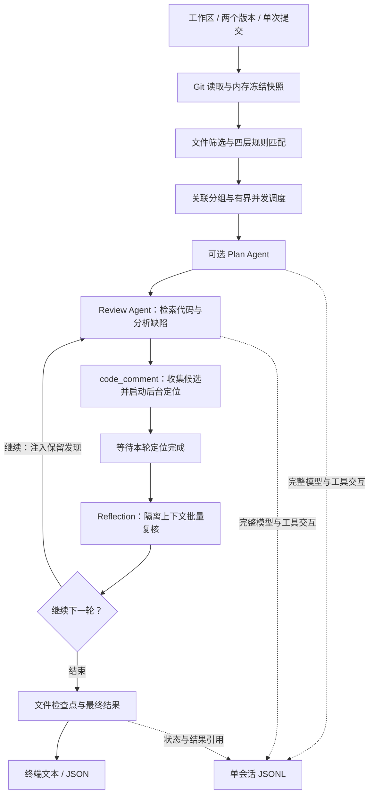
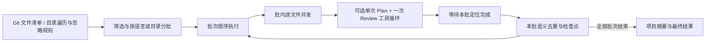
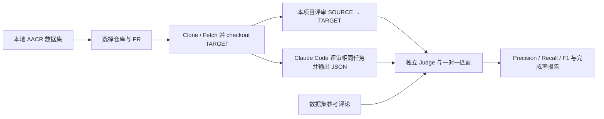

# Code Review Agent

基于 **Python + AgentScope** 的代码评审项目，支持 Git 增量评审和全项目扫描。固定流程负责版本读取、文件筛选、规则匹配、任务调度及结果存储，Agent 负责检索上下文、分析缺陷并提交评论。

默认中文，可切换英文；输出终端文本或 JSON，通过 Python 脚本执行。项目自带规则、提示词和 AACR 数据集，可独立运行，不依赖其他参考项目目录。

## 架构与执行流程

### Git Diff 评审



- **输入与规则**：从 Git 对象或工作区构造内存快照，工具读取同一份输入。规则按“自定义规则 → 仓库规则 → 显式全局规则 → 内置规则”匹配；相同正文只注入一次，多套规则使用 `<rules for="文件列表">` 标明范围。
- **分组与循环**：默认不足 4 个文件逐文件评审，至少 4 个文件由模型建议关联分组，每组最多 10 个文件；分组失败回退为逐文件处理，遗漏文件补齐。`low / medium / high` 最多执行 1 / 2 / 3 轮，后续轮次接收已保留发现，无新增保留发现时提前结束。
- **评论定位**：提交评论时启动定位，依次尝试 Hunk 匹配、完整新文件匹配、跨文件匹配、Re-location 模型重新提取代码并匹配。已有正行号直接接受；定位失败仍保留评论，未知行号为 `0`。
- **独立复核**：每组每轮新增评论一起交给 Reflection，只输入组内 Diff 与候选评论，不携带主评审历史。单次请求选择“报告错误评论”或“全部批准”；请求或解析失败时保守保留。
- **上下文管理**：按需调用只读工具补充跨文件信息，限制工具结果长度，并通过 AgentScope 压缩长历史。后续轮次使用提示词防重复，普通 Diff 不保证消除语义重复评论。

### 全项目 Scan



Scan 每个文件只执行一次主评审循环，不随 `effort` 增加外层轮次，也不执行 Diff 的 Reflection。Git 仓库通过 `git ls-files` 枚举，非 Git 目录遍历并处理根 `.gitignore`。可关闭 Plan、去重或摘要，去重解析失败时保留原评论。

### Agent 分工与工具

| 角色 | 执行方式 | 工具 / 职责 |
| --- | --- | --- |
| Diff Plan | 自主工具循环 | `file_find`、`file_read_diff`、`code_search`，生成评审计划 |
| Review | 自主工具循环 | `file_read`、`file_find`、`file_read_diff`、`code_search`、`code_comment`、`task_done` |
| Reflection | 单次模型调用 | 两个结果工具，批准或过滤本轮评论，无源码调查循环 |
| 分组、Scan Plan、Re-location、Scan 去重/摘要、Judge | 阶段模型调用 | 分组、规划、重新提取代码、合并评论、汇总或判分 |

自主检索工具的角色为 **Diff Plan 与 Review**。调度由 Python 流程完成。`file_read` 最多返回 500 行，每行使用 `行号|代码` 前缀；主评审工具不提供任意 Shell 或文件写入能力。

### 代码目录

```text
code_review_agent/
├── main.py                 # 日常评审与 Scan
├── session.py              # 会话查询与恢复
├── benchmark.py            # AACR 双评审器评测
├── config.example.json     # 配置模板
├── dataset/                # 本地数据集：版本信息与参考评论
├── src/code_review_agent/
│   ├── application/        # 参数、入口与运行协调
│   ├── inputs/             # Git、Diff、快照、筛选与文件枚举
│   ├── review/             # 规则、分组、Diff 多轮与 Scan 调度
│   ├── tools/              # 上下文检索、候选收集与完成工具
│   ├── runtime/            # AgentScope、模型、上下文与截止时间
│   ├── location/           # 评论定位与 Re-location
│   ├── reflection/         # 批量隔离复核
│   ├── sessions/           # 单 JSONL、文件检查点与回放
│   ├── evaluation/         # 仓库准备、评审器、Judge 与指标
│   ├── output/             # 文本 / JSON 呈现
│   └── resources/          # 提示词、规则与工具 schema
├── docs/                   # 设计与使用说明
└── tests/                  # 功能与边界验证
```

## 安装与模型配置

需要 Python 3.11+、Git 和支持 PCRE2 的 ripgrep。依赖安装到项目专用虚拟环境，AgentScope 版本固定在 `requirements.lock`。

在项目根目录执行：

```sh
python3 -m venv .venv
mkdir -p .cache/pip .cache/tmp
PIP_CACHE_DIR="$PWD/.cache/pip" TMPDIR="$PWD/.cache/tmp" .venv/bin/python -m pip install -r requirements.lock
cp config.example.json config.local.json
```

编辑 `config.local.json` 中的模型字段：

| 配置 | 用途 | 必要设置 |
| --- | --- | --- |
| `reviewer` | Plan、主评审及相关分析阶段 | `base_url`、`model`、`api_key` |
| `reflection` | Diff 独立复核 | 空的服务地址、模型和密钥继承 reviewer，可单独配置 |
| `judge` | 评测语义判分 | 显式配置服务、模型和密钥；正式评分 `temperature: 0.0` |

支持 OpenAI 兼容的 Chat Completions 接口。密钥也可通过 `CODE_REVIEW_REVIEWER_API_KEY`、`CODE_REVIEW_REFLECTION_API_KEY`、`CODE_REVIEW_JUDGE_API_KEY` 环境变量提供。日常评审不需要 Judge；`score` / `all` 评测阶段需要 Judge。

配置优先级：**命令行参数 > `CODE_REVIEW_*` 环境变量 > JSON 配置 > 默认值**。`config.local.json`、`claude.local.json`、虚拟环境及运行产物已加入 `.gitignore`。

## 真实代码评审命令

以下命令在项目根目录执行，将 `/path/to/repository` 换为待评审仓库的本地路径。

### 1. 工作区尚未提交的修改

```sh
.venv/bin/python main.py --config config.local.json \
  --repo /path/to/repository
```

评审暂存、未暂存及未跟踪文件合并后的最终工作区变更。

### 2. 比较两个版本

```sh
.venv/bin/python main.py --config config.local.json \
  --repo /path/to/repository --from main --to feature
```

版本可以是分支、标签或 commit SHA。日常 `--from / --to` 使用 merge-base 作为比较基点；数据集评测直接比较给定的两个提交。

### 3. 评审一次提交

```sh
.venv/bin/python main.py --config config.local.json \
  --repo /path/to/repository --commit HEAD
```

`HEAD` 表示当前提交，也可替换为指定 SHA，通常比较该提交与其父提交，无需自行计算 SHA。

### 4. 扫描整个项目或指定目录

```sh
.venv/bin/python main.py --config config.local.json \
  --repo /path/to/repository --mode scan

.venv/bin/python main.py --config config.local.json \
  --repo /path/to/repository --mode scan --scan-path src \
  --batch-strategy by-language --batch-size 50
```

`--scan-path` 相对于待扫描目录。Scan 也支持非 Git 源码目录。

### 预览、输出与常用参数

```sh
# 只预览文件筛选，不调用模型、不生成评审会话。
.venv/bin/python main.py --repo /path/to/repository --preview --format json

# 英文、高 effort，JSON 同时保存到本项目 reports/。
.venv/bin/python main.py --config config.local.json \
  --repo /path/to/repository --commit HEAD \
  --effort high --language en --format json --output reports/review.json
```

| 参数 | 含义 |
| --- | --- |
| `--effort low\|medium\|high` | Diff 最大 1 / 2 / 3 轮，默认 medium |
| `--language zh\|en` | 评论语言，默认中文 |
| `--format text\|json` | 最终输出格式，默认 text |
| `--output reports/review.json` | 将结果另存为项目内文件；默认输出到终端 |
| `--background "需求说明"` | 加入需求背景 |
| `--rule-file rules.json` / `--global-rule-file rules.json` | 指定本项目内规则文件 |
| `--include PATTERN` / `--exclude PATTERN` | 文件匹配过滤，可重复传入 |
| `--max-concurrency 8` | 评审组或 Scan 批内文件并发上限 |
| `--max-tool-iterations 100` | 主评审工具循环上限 |
| `--no-plan` / `--no-dedup` / `--no-summary` | 关闭对应 **Scan** 阶段 |

stdout 输出最终结果，stderr 输出进度与错误。退出码：`0` 完成/无文件/预览，`1` 失败，`2` 参数或配置错误，`3` 部分完成，`130` 中断。

### 上下文与超时

| 限制 | 默认值 | 范围与配置 |
| --- | --- | --- |
| 模型上下文 | 300,000 tokens | `--reviewer-context-tokens` 等角色参数；模型服务需支持所设容量 |
| 历史压缩触发 | 上下文容量的 80% | 默认约 240,000 tokens，通过 SDK 压缩历史 |
| 单次最大输出 | 16,384 tokens | `--reviewer-max-output-tokens` 等角色参数 |
| 单次模型请求 | 300 秒 | `--reviewer-timeout-seconds` 等角色参数 |
| Diff 单组总时间 | 15 分钟 × 最大轮数 | `--timeout` 单位为分钟；low / medium / high 为 15 / 30 / 45 分钟 |
| Scan 单文件总时间 | 15 分钟 | `--timeout`，不乘 effort 轮数 |
| 日常整次运行 | 默认不限 | `--review-timeout` 单位为秒 |
| 评测单 PR、单评审器 | 1,800 秒 | `--review-timeout` 调整外层限制 |

组/文件取得并发槽位后开始计时，Plan、主评审、压缩、定位和 Reflection 共享该截止时间；**没有每轮固定 300 秒的限制**。`--timeout 0` 取消组/文件限制，评测外层限制仍生效，评测中 `--review-timeout 0` 使用默认 1,800 秒。实际执行取组与外层截止时间中更早的一个。源码准备及 Judge 判分另计，不包含在这段评审额度内。

没有总 Token 预算；上下文容量、工具循环、输出长度和超时分别控制执行边界。

## 会话查询与恢复

```sh
.venv/bin/python session.py --action list --format json

.venv/bin/python session.py --action show \
  --session-id SESSION_ID --format json

.venv/bin/python session.py --action resume \
  --session-id SESSION_ID --config config.local.json --format json
```

`SESSION_ID` 从评审结果或会话列表获取。range、commit、Scan 支持恢复；工作区输入不支持跨运行恢复。

Resume 校验源码指纹、版本、规则、提示词、模型和生效配置，**复用已完成文件的结果，重新评审未完成文件**。Diff 正常执行按组调度，恢复按文件复用后重新分组；恢复创建新会话与新 Agent，不加载旧对话历史。Scan 的批次去重或摘要可能重新执行。

## AACR 数据集评测

评测本项目的真实评审流程与 **Claude Code 原生 Agent + 固定评审任务**。两边使用统一版本、背景和适用规则，输出统一评论格式，独立 Judge 按位置和语义进行匹配。



### 数据集与仓库源码

默认读取项目自带的 `dataset/positive_samples.json` 和 `dataset/negative_samples.json`，包含 **2,145 条评论、50 个仓库、200 个 PR**；不从 Hugging Face 下载，也不依赖外部数据集文件夹。

数据集是版本信息与标注，**不包含完整仓库源码**。执行评测时真实仓库克隆到 `.cache/benchmark-repositories/owner__name/`，补齐 SOURCE / TARGET commit，再将源码切换到待评审 TARGET。一个仓库包含多个 PR 和提交，同仓库复用一个副本、串行执行任务，跨仓库可配置并发。PR URL 用于样本归组，实际代码差异由数据集中的两个提交确定。

### Claude Code 配置

仅使用 `--reviewer project` 时不需要 Claude CLI。使用 `claude` 或 `both` 时需先安装并配置可用的 CLI：

```sh
claude --version
```

默认 Claude 继承 reviewer 的模型与凭据；已知 DeepSeek 入口自动映射到 `/anthropic`。其他服务需提供 Anthropic 兼容地址，可设置 `CODE_REVIEW_CLAUDE_BASE_URL`，或通过 `--claude-config claude.local.json` 提供 `base_url`、`model`、`api_key`、`command`。

评测采用非 bare CLI、独立配置与工具守卫，最终 JSON 上报缺陷，不需要 MCP；隔离个人配置、自动加载的 `CLAUDE.md` 与记忆。数据集标注只进入 Judge，不提供给评审器。

### 评测命令

```sh
# 先走通 GoFR 的一个 PR：两个评审器都执行，并完成判分与报告。
.venv/bin/python benchmark.py --config config.local.json \
  --run-id gofr-one-001 --stage all --reviewer both \
  --repo gofr-dev/gofr --limit 1 --format json

# GoFR 的全部 6 个 PR：不传 --limit。
.venv/bin/python benchmark.py --config config.local.json \
  --run-id gofr-all-001 --stage all --reviewer both \
  --repo gofr-dev/gofr --format json

# 抽样 5 个仓库，执行这些仓库的所有 PR。
.venv/bin/python benchmark.py --config config.local.json \
  --run-id aacr-five-001 --stage all --reviewer both \
  --repo-count 5 --seed 42 --format json

# 仅评测本项目，无需 Claude CLI。
.venv/bin/python benchmark.py --config config.local.json \
  --run-id project-gofr-001 --stage all --reviewer project \
  --repo gofr-dev/gofr --format json
```

多行命令的续行必须保留行末 `\`；也可合并为一行执行。已有虚拟环境激活后，也可以将 `.venv/bin/python` 换为 `python`。

| 参数 | 含义 |
| --- | --- |
| `--run-id NAME` | 本次评测标识与存储目录；不同范围、实现或配置使用新 ID |
| `--stage prepare\|review\|score\|report\|all` | 只运行指定阶段，或依次运行全部阶段 |
| `--reviewer project\|claude\|both` | 本项目、Claude Code 或两者，默认 both |
| `--repo owner/name` | 限定数据集中的一个仓库，例 `gofr-dev/gofr`；不同于 main.py 的本地路径 |
| `--repo-count 5` / `--seed 42` | 未指定 `--repo` 时按种子抽样；默认 10 个仓库、seed 42 |
| `--limit 1` | 本次范围内的 PR 总数上限，不是仓库数；省略则执行所选仓库全部 PR |
| `--repetitions 3` | 每个 PR、每个评审器独立执行 3 次，默认 1 次 |
| `--repository-concurrency 1` | 不同仓库的并发数，默认 1；同仓库任务始终串行 |
| `--review-timeout 2700` | 每个 PR、每个评审器评审最多 2,700 秒，默认 1,800 秒 |
| `--k 1` | 评分的位置容差，默认 1 行 |
| `--score-id ID` | 报告使用指定评分版本，默认最新版本 |
| `--dataset-dir dataset` | 指定本地 AACR 数据目录，默认项目自带 dataset/ |

指定 `--repo` 时只选择该仓库，不额外抽样十个仓库。默认一次评审不等于只评审一个 PR。

### 分阶段执行与重试

`--stage all` 顺序执行 **prepare → review → score → report**：

| 阶段 | 做什么 |
| --- | --- |
| prepare | 读取数据集，固定实际仓库与 PR 范围；仓库源码在评审任务执行时准备 |
| review | 准备源码，运行所选评审器，保存评论、状态和用量 |
| score | Judge 判分与一对一匹配，保存评分记录 |
| report | 从已有评分生成指标和报告，不重新调用评审器 |

```sh
.venv/bin/python benchmark.py --config config.local.json \
  --run-id staged-gofr-001 --stage prepare --repo gofr-dev/gofr

.venv/bin/python benchmark.py --config config.local.json \
  --run-id staged-gofr-001 --stage review --reviewer both

.venv/bin/python benchmark.py --config config.local.json \
  --run-id staged-gofr-001 --stage score --k 1

.venv/bin/python benchmark.py --config config.local.json \
  --run-id staged-gofr-001 --stage report --format json
```

后续阶段读取已保存范围。相同实现与配置下，重新运行 `review` 会跳过已完成任务、重试未完成任务；随后执行 `score` 与 `report` 更新指标。重复次数需与原运行保持一致。若提示 `Implementation/configuration changed; use a new run_id`，应换新 ID；`This benchmark run is already active` 表示同 ID 正被其他进程执行，不要重复启动。

### 指标口径

- **M**：位置与语义都匹配的评论数，采用一对一匹配。
- **G**：评审器生成的最终评论总数，包含重复评论与未知位置评论。
- **N**：有效正样本参考评论数。
- **Precision = M / G，Recall = M / N，F1 = 2M / (G + N)**；报告同时呈现 micro、按仓库 macro 和完成率。

这是相对于数据集参考评论的匹配指标，未匹配评论不能直接视为真实误报。失败、部分完成和 Judge 未判定会影响报告完整性，不能把未完成运行当作完整效果结论。

## 结果存在哪里

以下路径均相对于项目根目录：

```text
.cache/benchmark-repositories/owner__name/    # 下载的真实 Git 仓库与源码
.state/
├── sessions/SESSION_ID.jsonl                # 一次本项目评审的交互、检查点与结果
└── benchmarks/RUN_ID/
    ├── dataset.json                        # 数据身份、参考评论与实际选择范围
    ├── run.json                            # 任务计划、状态、尝试与最新评分 ID
    ├── reviews/project/JOB_ID.json          # 本项目最终评论与执行结果
    ├── reviews/claude/JOB_ID.json           # Claude 最终评论与执行结果
    ├── scores/SCORE_ID.json                 # Judge 判分与匹配明细
    ├── judge-cache/KEY.json                 # 可复用的 Judge 判分
    └── reports/SCORE_ID.json                # 汇总指标，含 Precision / Recall / F1
reports/
├── review.json                             # 仅在 --output 指定时生成
└── benchmarks/RUN_ID/SCORE_ID.md            # 可阅读的评测报告
```

日常评审默认将结果输出到终端，并生成一个会话 JSONL；`--output` 可另外导出结果。`.cache` 存源码缓存与临时文件，`.state` 存实际结果和恢复信息，`reports` 存阅读/导出的报告。

### 单会话 JSONL 保存什么

记录采用 AgentScope `CustomEvent` 格式，聚合为完整调用，**不保存逐块流式事件**。同一会话的并发 Agent 共用一个文件，通过 `unit_id`、`stage`、`operation_id` 等关联字段区分。

| 记录名 | 内容与用途 |
| --- | --- |
| `session_start` | 生效配置、仓库版本、文件指纹与规则/模型身份，供恢复校验 |
| `model_call` | 完整请求消息、工具声明、响应/错误、重试、用量和耗时，供排查模型行为 |
| `tool_execution` | 实际工具名、参数、最终输出/错误和耗时，供追踪检索与提交过程 |
| `review_item` | 文件 completed/failed/reused 状态、候选和定位/复核结果，作为文件检查点 |
| `scan_batch_finalized` | Scan 批次去重后的最终展示引用与必要改写 |
| `session_end` | 运行状态、覆盖、摘要、统计与最终评论引用 |

请求记录包含当时使用的消息，但 Resume 不接续旧对话；恢复依据是文件检查点。完整源码快照只存在于内存，不额外写独立快照文件。

## 开发验证

```sh
PYTHONDONTWRITEBYTECODE=1 .venv/bin/python -m pytest -q
.venv/bin/python -m ruff format --check .
.venv/bin/python -m ruff check .
.venv/bin/python -m mypy
.venv/bin/python tests/verify_project.py
```

测试验证功能和边界，不能替代真实模型效果评测。

查看完整参数：`.venv/bin/python main.py --help`、`.venv/bin/python session.py --help`、`.venv/bin/python benchmark.py --help`。
